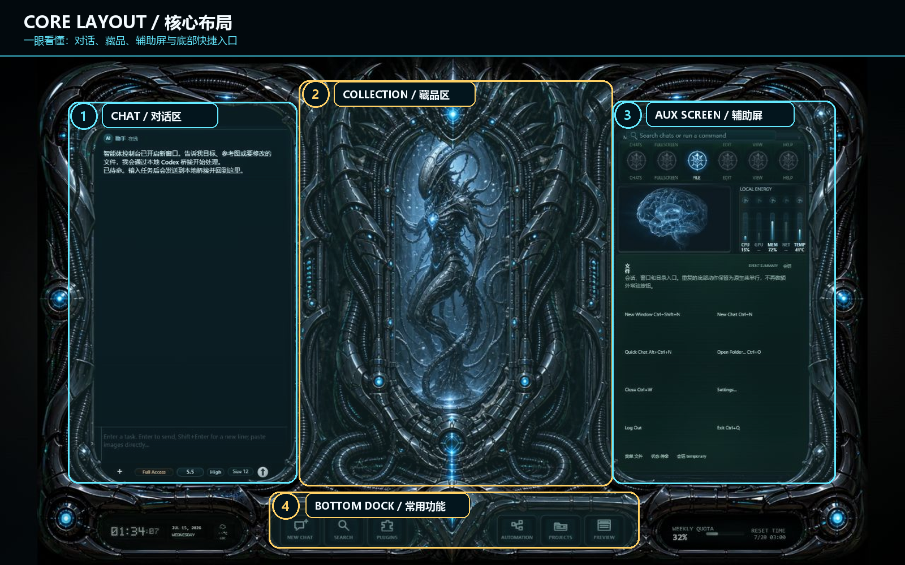
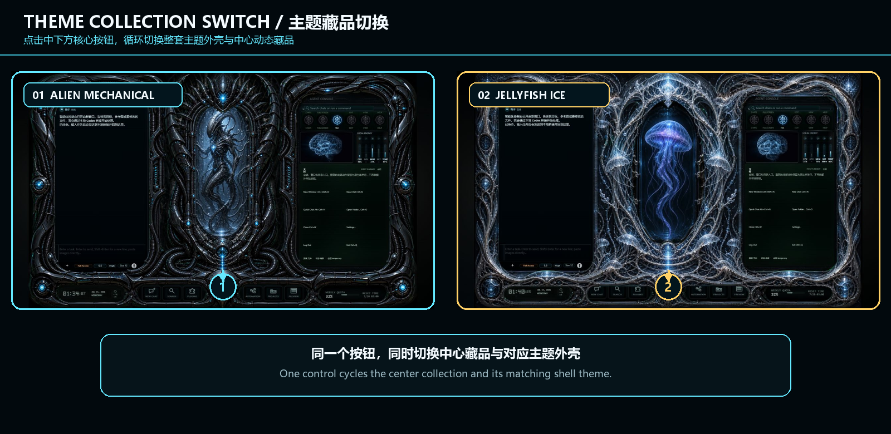
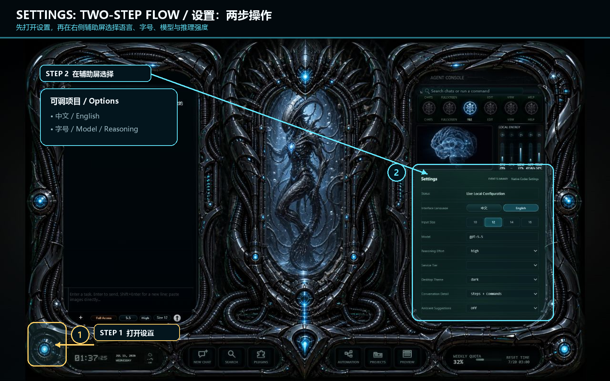
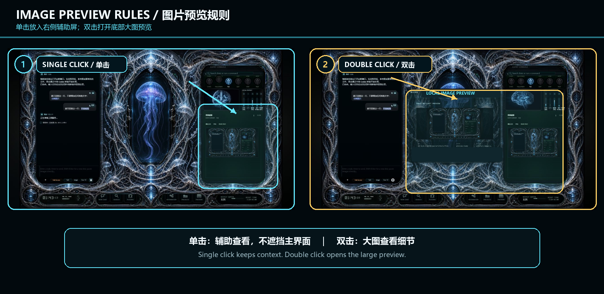

# CODEX 生物机械控制台

## 给 Codex 不只换一张脸，而是装进一具会工作、会回应的未来身体。

连接真实 Codex，把对话、运行、审批、等待、完成和项目预览，重新组织成一台可以每天使用的本地沉浸式 AI 控制台。

**不是游戏概念图，不是覆盖在原版界面上的壁纸，也不是只有颜色变化的网页主题。**

- 真正调用本机 Codex，会写文件、执行命令并持续原生会话；
- 三舱式控制台把对话、动态藏品、设置和项目预览放进同一套交互骨架；
- 长对话在变卡前主动提醒，复制副本可单独释放磁盘空间；
- 外壳与中央藏品可以独立更换，也能让自己的 Codex 帮你制作新主题；
- 核心运行系统闭源，开放的是经过校验的数据型外观创作层。

> 当前公开下载仍以 Releases 页面实际列出的版本为准。本文包含 **Beta 4 验收候选预览**；Beta 4 尚未公开发布，也不会在双平台验收完成前冒充正式版本。



## 它到底多做了什么

### 1. 真正工作的沉浸式控制台

左舱负责对话、文件与输入，中舱负责主题藏品和运行氛围，右舱负责设置、会话列表、状态与辅助预览；底部保留新对话、搜索、插件、电脑控制、项目和实时预览入口。

它不修改 Codex Desktop，也不需要每次先打开 Desktop 窗口。控制台会连接本机 Codex 的真实运行能力，自己的对话空间可以与 Desktop 同时存在。

### 2. 对话不是堆在一起，而是真正分类

Beta 4 候选把列表改为四个互斥入口：**置顶、普通、归档、导入本机 Codex 对话**。点哪一栏，就只显示哪一栏。

导入时可以：

- **接管同一条对话：** 继续原生记录；
- **复制为独立新对话：** 创建可单独工作的副本；
- **永久删除复制副本：** 只清理副本，原对话和项目文件不受影响；
- **从控制台移除：** 只解除绑定，不删除磁盘记录。

大对话复制会显示处理阶段和已耗时。Codex 没有提供真实字节进度时，控制台不会伪造百分比。

### 3. 比原生工作流多一步的人性化预警

单条会话历史达到 **50 MiB** 时显示“历史较重”，达到 **100 MiB** 时升级为“历史临界”。提醒会说明图片和长历史可能拖慢后续回复，并提供“新建会话”入口。

提醒不会自动删除、归档、切换或中断当前任务；原历史始终保留。

### 4. 本地项目就在控制台里看

当前任务启动本地服务后，可以直接在控制台中打开、刷新、滚动和交互，也可以在系统浏览器打开或保存截图。项目预览只接受本机回环地址。

### 5. 电脑控制与文件权限分开

Computer Use 提供“每步询问 / 自动审查 / 完全控制”三档，和文件、命令访问权限分别管理。界面只显示真实能力；目标智能体不支持的功能不能用一个假按钮代替。

### 6. 先是一套作品，再变成创作者生态

Beta 4 Appearance V1 把**外壳主题**和**中央藏品**拆成两个独立选择器。用户可以使用官方典藏款，也可以导入自己制作的安全外观包。



## 心脏、骨架、皮相、角色

```text
第一层：心脏  →  真实 Codex Runtime，闭源运行核心
第二层：骨架  →  官方设计的屏幕结构、功能布局与交互母版
第三层：皮相  →  开放的外壳、材质、背景、动效与中央藏品
第四层：角色  →  Agent 形象、身份、音色与表达风格（规划中）
```

**功能由我们维护，主题由每个人创造。**

Beta 4 已开放第三层中的外壳与藏品；布局编辑器和可安装 Agent 角色包尚未实现。头像、名称设置不等于角色包系统。

外观包只允许声明、参数和经过校验的本地数据与媒体。它不能携带 JavaScript、命令脚本、远程代码、Provider、接口或密钥，也不能改变权限、伪造运行状态或脱离控制台核心独立运行。

## Creator Kit：让自己的 Codex 帮你造一套

Beta 4 候选发布包附带外观创作工具包，包含：

- 外壳与中央藏品安全区模板；
- 赛博朋克、军事、国风机关、鲜花宫殿和深海主题提示词范本；
- 可直接复制的外壳包、藏品包示例；
- 本地校验与 SHA-256 清单工具；
- 导入、恢复默认和截图分享说明。

最短流程：告诉 Codex 你想要的世界 → 选择模板 → 生成媒体 → 本地校验 → 导入控制台 → 晒出自己的座舱。

Creator Kit 只教开放外观层，不包含核心接入、账号、Provider 或绕过产品边界的方法。

## Beta 4 实验入口：模型配置

Beta 4 候选把“模型配置”放到明面入口，并分成 **智能模型、语音识别、语音合成** 三个功能区。Provider Hub 位于智能模型区，目标是让用户在官方 Codex 登录之外，验证自己拥有的 OpenAI 兼容服务。

当前设计不是“随便填一个 Base URL 就假装能用”，而是分阶段验证：

1. API Key 只提交给本机核心，不写入浏览器 `localStorage`、普通配置或日志；Windows 使用当前用户的 **DPAPI** 加密保存。
2. 读取模型列表，确认服务可连接。
3. 检测 **Responses API** 和结构化工具调用。
4. 再运行一次隔离的**完整 Codex 回合**，收到真实流式事件后才允许应用。
5. 切换失败自动回滚，旧连接不会被半套配置污染。

恢复官方连接时，控制台会同时删除当前第三方 DPAPI 凭据和对应探针，避免不再使用的 Key 长期残留。

只提供 **Chat Completions** 的中转站不能驱动当前 Codex，因此即使聊天测试成功也不能点击“应用”。

### 点力 Token 预设

候选中预置了点力 Token 的固定入口和官网链接，方便测试合作方提供的模型。官网链接由核心返回固定 HTTPS 地址，客户端不接受页面随意指定跳转地址。

这只是技术适配入口：目前不代表已经与点力 Token 签署分成、返佣或代理条款，也不代表它的 LLM 模型已经通过我们的完整 Codex 实机验收。用户是否能在自身网络环境使用，取决于该服务的 Responses 兼容性、模型能力和实际连通性；在真实临时 Key 验收前，不宣传“无需 VPN”。

曾在聊天里公开过的 Key 一律按泄露处理，不会被复用。正式测试必须使用新建或已轮换的临时 Key。

### 语音服务不是同一件事

点力 Token 已提供 `SenseVoiceSmall` 与 `TeleSpeechASR` 两个 ASR 模型。隔离真人探针使用 **3 段普通话录音 × 2 个模型，共 6 次请求**，全部返回 **HTTP 200**。现有结果把 `SenseVoiceSmall` 设为默认模型，`TeleSpeechASR` 作为用户手动选择的故障回退。

合作方接口接受 MP3/WAV；Windows 客户端只录制并上传 **16 kHz 单声道 WAV**。只有用户明确开始并结束云端录音后，这一段录音才会提交给第三方；返回文字保持可编辑，识别结果不会自动发送。

这两条 ASR 成功证据不能证明 LLM Provider 兼容，智能模型仍要单独通过 Responses、工具调用和完整 Codex 回合。Windows 云端 ASR 仍是 **Beta 4 本机验收候选**；macOS 云端语音当前不可用。语音合成 / TTS 继续等待服务商提供并验证接口、模型、音色、计费和数据处理资料。

合作方尚未确认上传音频的保存期限与隐私政策，因此我们不替第三方作“绝不保存”的承诺；也不把该入口宣传成 OpenAI 官方语音、无需 VPN 或已经正式上线。

## 常用交互

### 设置采用两步操作



先点击左下发光设置节点，再在右侧辅助屏选择语言、输入字号、模型、智能等级、外观与连接设置。顶部“语言”会打开同一页，语言和字号会被记住。

### 图片单击与双击各有用途



- 单击：在右侧辅助屏预览，不挡住主工作区；
- 双击：在底部打开大图检查细节；
- 保存：使用预览里的明确“保存图片”按钮。

### 用户与 Agent 可以有各自身份

设置中可分别修改双方名称和头像，只影响控制台内显示，不会修改 Codex 账号资料。

## 当前版本边界

### 已公开 Beta 3

- 需要本机已安装 Codex，并完成可用的官方 ChatGPT 账号认证；
- Windows 11 64 位；macOS 仅 Apple Silicon；
- Provider 在 Beta 3 中仍为只读状态；
- Windows 未商业代码签名；Mac 未 Apple 公证。

### Beta 4 验收候选

- 四分类会话列表、复制进度、复制副本删除和长历史提醒；
- Appearance V1 与 Creator Kit；
- 封装交互骨架，不再把主页面、程序脚本和样式源码树作为松散资源发布；
- Windows 模型配置与云端 ASR 实验验收入口；
- 仍需 Windows 真实大对话复测、真实第三方临时 Key 验收，以及同提交的 Apple Silicon 构建与真机验收。

Provider Hub 在 macOS 上必须先完成系统 Keychain 凭据实现与真机验证，不能把 Windows DPAPI 方案直接当成跨平台完成。

## AI 优先安装

1. 从 [Releases](https://github.com/springwen131130-del/codex-biomechanical-console/releases) 下载与系统对应、实际公开的 Beta 包。
2. 核对 Release 页面提供的 SHA-256。
3. 把 ZIP 本地路径交给 Codex，为安装任务开启所需文件与命令权限。
4. 让 Codex 先阅读压缩包内 `AI_READ_FIRST.txt`，再校验、安装、启动和检查。

升级时直接覆盖安装，不要先卸载旧版；会话映射、头像、语言与本机设置应继续保留。

## 两套工作台如何相处

Codex Desktop 与本控制台默认拥有各自的对话、模型、权限和任务状态，可以同时运行，但不要同时修改同一个项目中的同一批文件。

“接管同一条对话”会继续写原记录，Desktop/CLI 重新载入后才能看到新增内容，请勿两端同时操作同一会话。“复制为独立新对话”只复制会话记录，不复制项目文件；需要并行开发时，请为副本准备独立目录或 Git worktree。

## 安全与隐私

- 本项目是第三方沉浸式 Codex 客户端，不是 OpenAI 官方产品；
- 官方账号认证只读；控制台不提供登录、退出或切换账号；
- 不公开私有 Bridge、会话协议、权限和 Provider 路由核心；
- 外观创作层开放，核心运行系统闭源；
- 不把 API Key 写进主题包、前端存储、日志或 Git；
- 不从来源和哈希不明的地址安装；
- 任何本机软件都不能诚实承诺“绝对无法逆向”，当前封装目标是缩小暴露面并提高篡改与借壳成本。

## Download / 下载

只从本仓库的 [Releases](https://github.com/springwen131130-del/codex-biomechanical-console/releases) 下载公开体验包。Beta 4 只有在 Windows 与 Apple Silicon 验收、泄露扫描和哈希记录完成后才会发布。

如果你也觉得 AI 工具不该只剩一块白色聊天框：

- 给仓库一个 Star，方便回来查看新版本；
- 用 Creator Kit 做出自己的外壳或藏品；
- 截图分享你的 Codex 座舱，让下一个世界从你的版本继续长出来。

## English summary

**Give Codex more than a new face—give it a futuristic body that works and responds.**

CODEX Biomechanical Console is a third-party local client connected to real Codex capabilities. It adds an immersive three-bay interaction chassis, explicit conversation management, proactive 50/100 MiB history notices, interactive local project preview, validated data-only appearance packs, and a Creator Kit.

Public downloads remain whatever is actually listed on the Releases page. Beta 4 is still an acceptance candidate. Its Windows-only experimental Provider Hub requires Responses API compatibility, structured tool calls, and a complete streamed Codex turn before a provider can be applied. Chat Completions alone is insufficient. Dianli ASR passed six isolated human-recording requests across both advertised models, but the Windows 16 kHz mono-WAV integration still requires owner acceptance; results remain editable and are never auto-sent. macOS cloud speech and TTS are unavailable. Windows is not commercially code-signed; macOS is not Apple-notarized and still requires an Apple Silicon build and real-device verification from the same commit.
